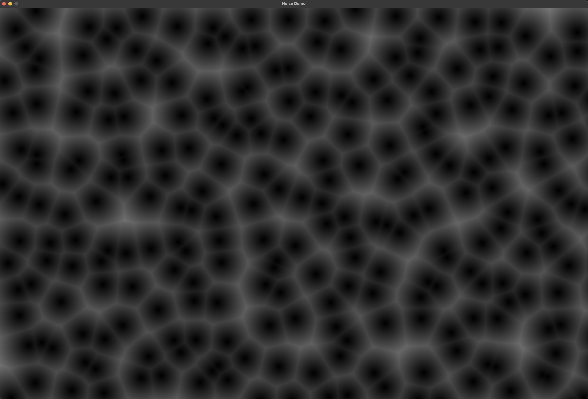

# noise-generator
Noise generator with visualisation written using SDL2 library.

Program to generate and visualize Gradient, Fractal and Cellular noise using various algorithms.

Controls:
  - '1' to generate White noise.
  - '2' to generate 2D Perlin noise.
  - SHIFT + '2' to generate 1D Perlin noise.
  - '3' to generate 2D Worley noise.
  - 'r' to clear screen.

Sources:
  - https://adrianb.io/2014/08/09/perlinnoise.html
  - https://www.shadertoy.com/view/slB3z3
  - https://thebookofshaders.com/12/
  - https://www.scratchapixel.com/lessons/procedural-generation-virtual-worlds/procedural-patterns-noise-part-1/introduction.html

